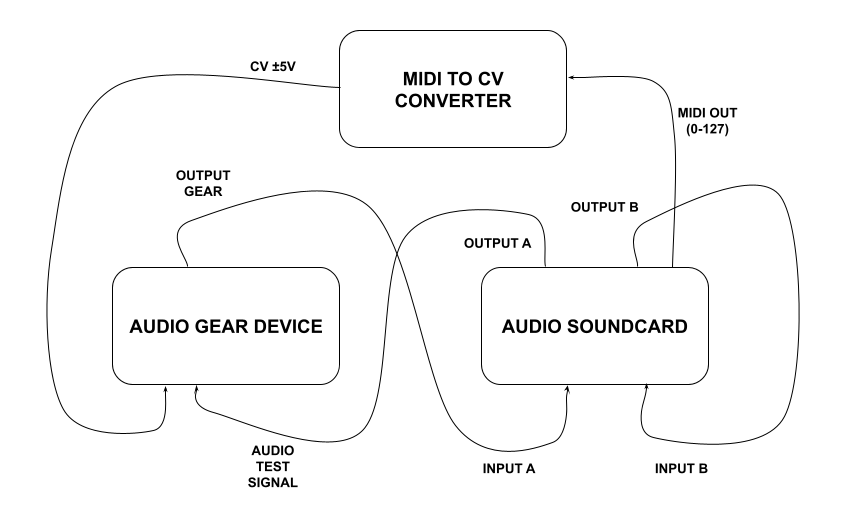

# Digital and analog levels calibration with reference signal

This document exposes the guidelines to keep a reference in terms of voltage and level scaling between audio digital and analog professional gear.

When we try to sample audio gear or we need to have the same reference using digital scales like dBFS, it is not clear how to map this scale to dBu or voltage levels.

To simplify it we use Dolby calibration proposed in K-System.

## Table of contents

- [Digital and analog levels calibration with reference signal](#digital-and-analog-levels-calibration-with-reference-signal)
  - [Table of contents](#table-of-contents)
  - [dBFS to dBu reference](#dbfs-to-dbu-reference)
  - [dBu to Voltage](#dbu-to-voltage)
  - [Vrms, Vpeak and Vpp](#vrms-vpeak-and-vpp)
  - [Standards](#standards)
    - [EBU R68](#ebu-r68)
    - [SMPTE R155](#smpte-r155)
  - [Routing](#routing)
  - [Procedure](#procedure)

## dBFS to dBu reference

We propose to use Dolby calibration explained by Bob Katz in K-System document [1]. Dolby calibration tries to relate the digital scaling, dBFS, to loudness scaling, VU, which can be mapped to dBu levels. dBu scaling is very current in audio gear scaling using peakmeters and sound pressure levels, dBC.

To sample audio gear, we don't need to have a sound pressure level reference, but dBFS to dBu mapping is a very good starting point.

So, thanks to Dolby calibration we know:

`-20dBFS -> 0VU -> +4dBu -> 83dBC`

Any professional audio device works with line signals referenced to +4Bu. For calibrating a digital recorder with analog scaling we will utilize chiefly the following mapping:

`-20dBFS -> +4dBu -> 1.23V`

## dBu to Voltage

The dBu are defined as follows:

`dbu = 20 · log10(voltage/0.775VRMS)`

and we can estimate the voltage for each dBu value:

`voltage = 10 ** (dBu / 20) * 0.775VRMS`

voltage is in RMS not peak and 0.775VRMS term is the reference voltage, which corresponds to the voltage that applied to `600Ω` provides 1mW power.

So, having a dBu scaling we can know also the voltage values for an specific dBFS value.

## Vrms, Vpeak and Vpp

Remember that a sinusoid signal with `1V` amplitude would have an RMS of 0.707Vrms or -3dB of the peak level.

But Vpeak it is not the same than Vpp.

Vpeak describes the maximum peak value in a signal or a signal block. Instead Vpp, measure the dynamic range between the positive peak and the negative peak, i.e. 1Vpeak sinusoide matches to 2Vpp.

## Standards

There exist two standard for referencing digital and analog levels: EBU R68 and SMPTE R155.

### EBU R68

It defines an standard which maps 0dBFS to 18dBu. So the reference level is at -14dBFS with +4dBu. EBU R68 is usually used by European equipment manufacturers. You can reproduce it in a table using `level_table.py` specifying the standard in the parameter `--standard`.

### SMPTE R155

This standard maps 0dBFS to +24dBu. The referenece level +4dBu matches with -20dBFS. There is a 6dB difference among the different standards. To know which standard is used in specific gear, we can measure the voltage level at the output with a known dBu level. This standard is usually applied by US manufacturers.

## Routing

There are different ways to route but for this challenging task, we want to eliminate any contamination or deviations. So we need to connect our test signal generator and the digital audio recorder directly to the input and output gear, without mixers or spliters.

Nowaways, with a computer we can simplify the routing with an external audio soundcard. So we can reproduce the test signal and to record it at the same time.

We need to create a loopback to ensure the unary gain in our soundcard. The loopback let us know the gain level to get the same levels at the input than at the output. As a test signal we usually use log sine sweep signals which let us extract the impulse response in a postprocessing.

In case we have to send CV signals to modify parameters with external signals, we have generate CV signals between ±5V. We can use a pulse with the same lenght of the test signal. We can also use a MIDI to CV converter which might offer more control and to avoiding measuring voltage with a voltagemeter.

## Procedure

  1. Revise the maximum output level in your soundcard specifications. This might be usuful to know which levels we are sending to the audio gear device. We can use this level to know which levels we are sending to the audio device we want to sample.
  2. Build a loopback with a TRS cable from an output to an input on your soundcard. We will use the loopback to record the test signal if we need to extract the impulse response and to remove the soundcard frequency response in our recordings. The loopback also can be useful to find the unary gain in our soundcard.
  3. Plug a TS cable to the audio device to measure. Remember a TS cable has a 6dB loss in comparison with a TRS cable.
  4. Plug a TS cable to the output of the audio device to the input of your soundcard.
  5. Check the signal you get is not distorted using unary gain estimated with the loopback.
  6. If you need to generate CV signals, as we mentioned we can generate them with a positive pulse. However it can be simplified if we use MIDI to CV converter.

